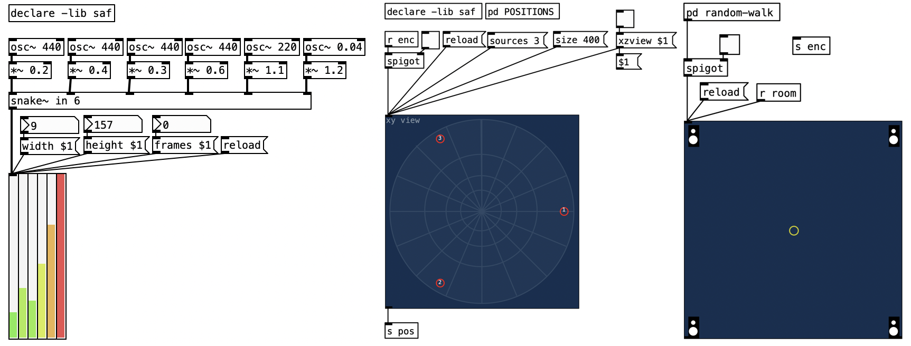

# `pd-saf`: Spatial Audio Framework for PureData

  
  

## About

SAF-PD is a collection of PureData external objects that bring professional spatial audio processing capabilities to PureData, powered by the Spatial Audio Framework (SAF). These objects provide high-performance implementations of various spatial audio algorithms including Ambisonics processing, binaural rendering, VBAP, and more.

## Features

- **Ambisonics Support**: Encoding, decoding, rotation, and binaural rendering.
- **Binaural Processing**: HRTF interpolation and binaural rendering.
- **VBAP**: Vector-based amplitude panning.
- **Room Simulation**: Reverberation and room modeling.
- **High Performance**: Optimized with SIMD and BLAS/LAPACK support.

## Installation

- TODO: Upload on deken.

## Available Objects

### Signal Objects 

- `saf.encoder~`: Ambisonic encoder (beta).
- `saf.decoder~`: Ambisonic decoder (alpha).
- `saf.roomsim~`: Shoebox room Ambisonic encoder (alpha).
- `saf.binaural~`: Binaural Ambisonic decoder (alpha).
- `saf.binauraliser~`: Binauraliser Ambisonic signals (alpha).
- `saf.pitchshifter~`: Pitch shifter for ambisonic signals (alpha).

### Gui Objects

- `saf.meter~`: Multichannel meter (beta).
- `saf.panning`: Ambisonic panner (beta).
- `saf.roompanning`: Room panner (alpha).

## License

This project is under GPL3.

## Contributing

Contributions are welcome! Please open an issue or pull request on GitHub.

## Support

For questions or support, please open an issue on the GitHub repository.
